# 🔧 Auto Mechanic Shop Database

A Microsoft Access-based relational database system designed for *AutoTrack*, an NYC auto repair shop. It manages customers, vehicles, services, parts, invoices, and employees in a streamlined, centralized environment.

---

## Purpose

- This database was created for *AutoTrack*, a growing auto mechanic shop in New York City, to replace inefficient manual recordkeeping with a modern digital solution. The system manages customer profiles, vehicle details, appointments, services, parts inventory, suppliers, invoices, and employee records. By centralizing these elements, the application reduces errors, streamlines operations, enables faster appointment scheduling, supports real-time inventory tracking, simplifies payroll, and ensures seamless billing and reporting — all while supporting the shop’s scalability and long-term growth.

---

## 📁 Project Structure

| Folder          | Contents                                         |
|-----------------|--------------------------------------------------|
| `documentation/`| Project Report PDF, ER Diagram                   |
| `forms/`        | MS Access Data Entry Forms                       |
| `reports/`      | MS Access Reports                                |
| `queries/`      | SQL Query Screenshots                            |
| `vba/`          | VBA Formatting Code                              |

---

## 📄 Documentation

- [📄 Full Project Report (PDF)](documentation/Auto%20Mechanic%20Shop%20Database%20Project.pdf)
- 

---

## 🗂️ MS Access Forms

| Form Name      | Screenshot |
|----------------|------------|
| Customer Form  | 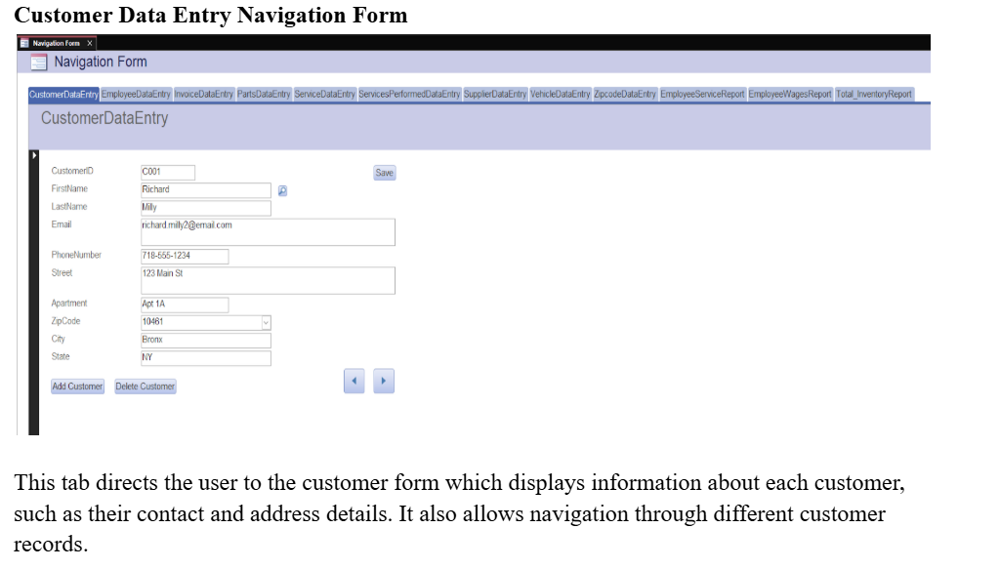 |
| Employee Form  | 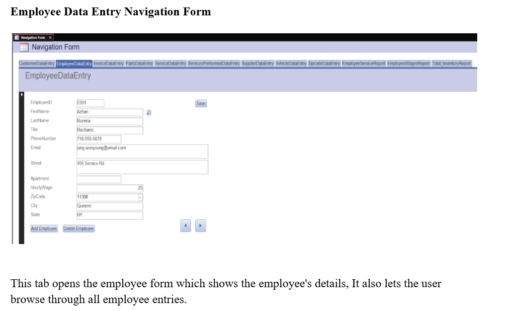 |
| Invoice Form   | 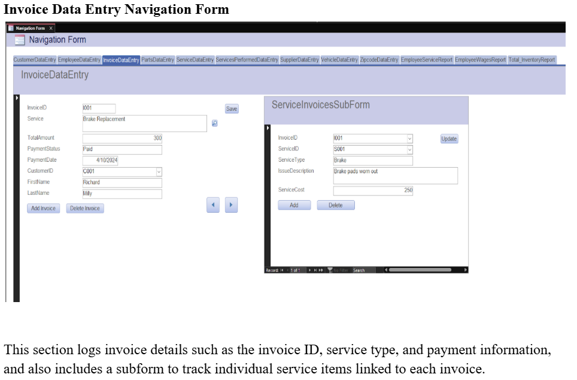 |
| Parts Form     | 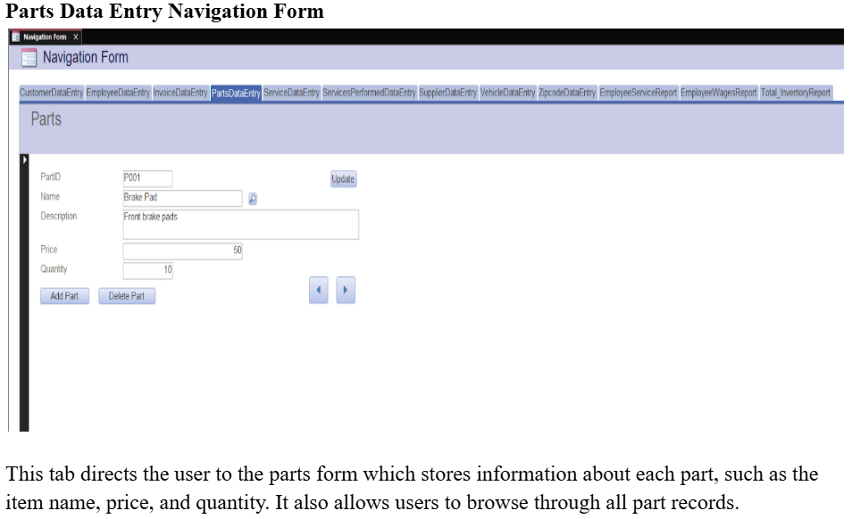 |
| Service Form   | 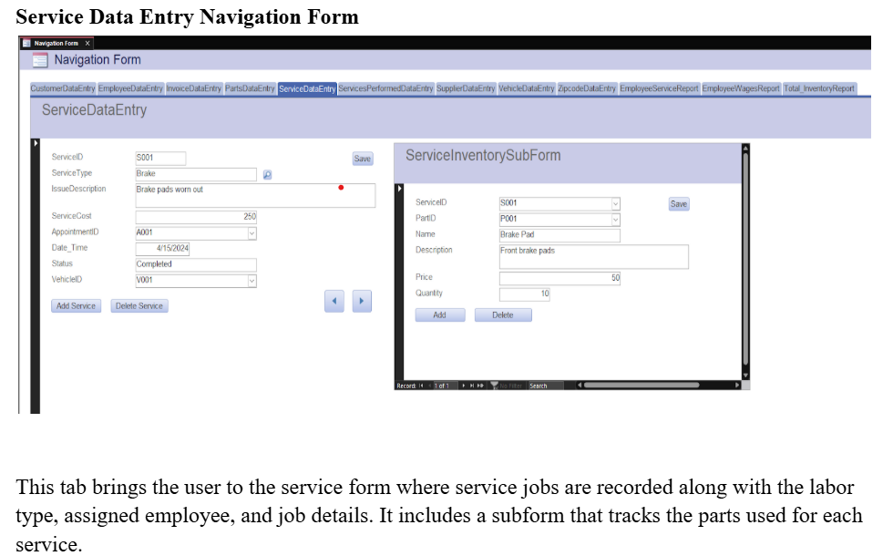 |
| Vehicle Form   | 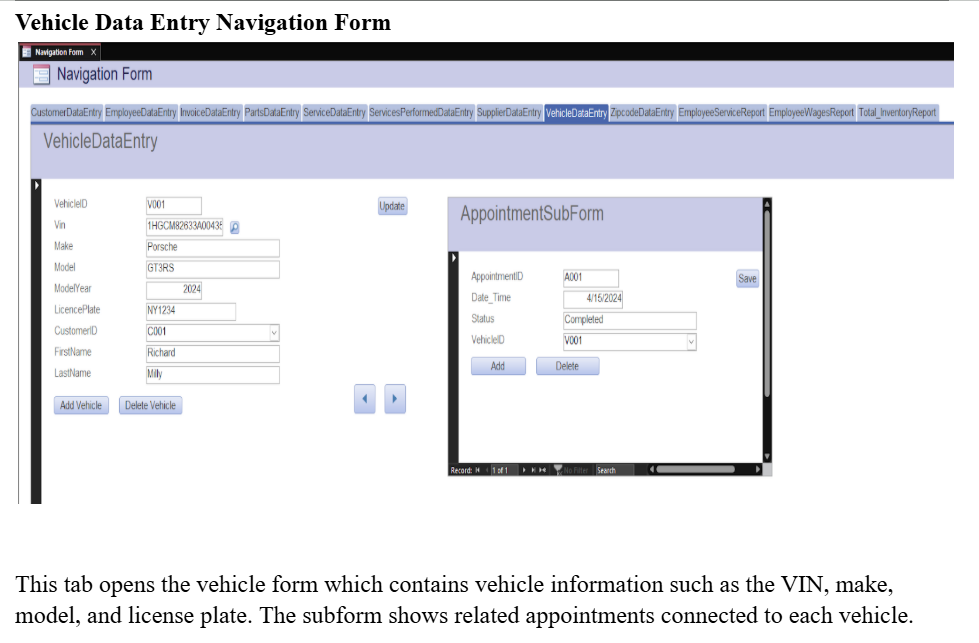 |

---

## 📑 Reports

| Report Name             | Screenshot |
|-------------------------|------------|
| Employee Wages Report   | 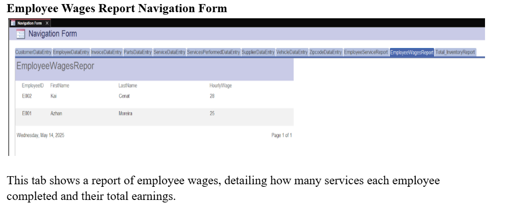 |
| Total Inventory Report  | 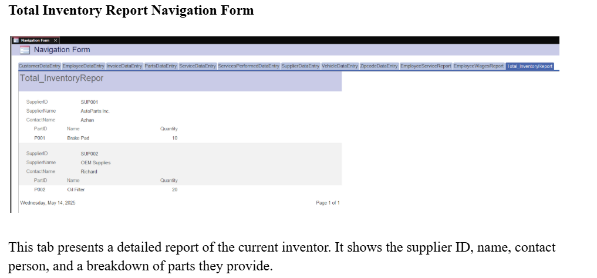 |
| Employee Service Report | 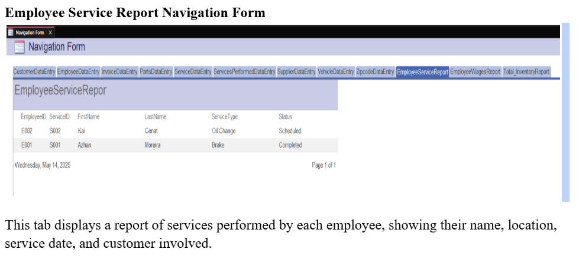 |

---

## 💻 Queries

Common SQL queries were used to retrieve and combine data across normalized tables. Example:

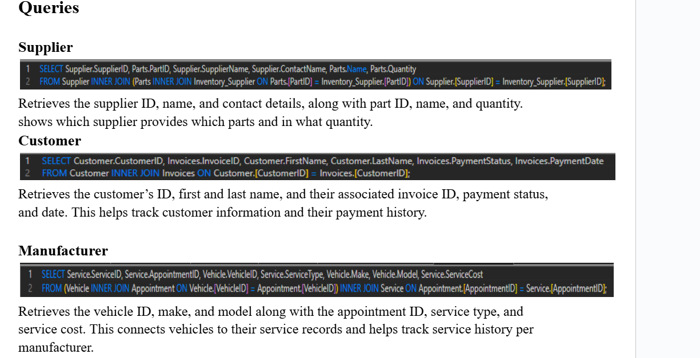

---

## 🧠 VBA Enhancements

Custom VBA functions were created to auto-format data:

| VBA Task            | Screenshot |
|---------------------|------------|
| Capitalize Names    | 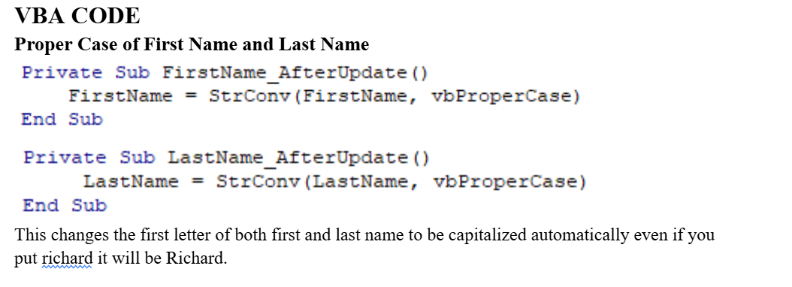 |
| Format Job Title    | 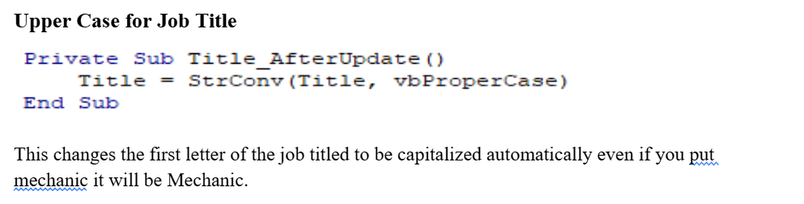 |
| Format City & State | 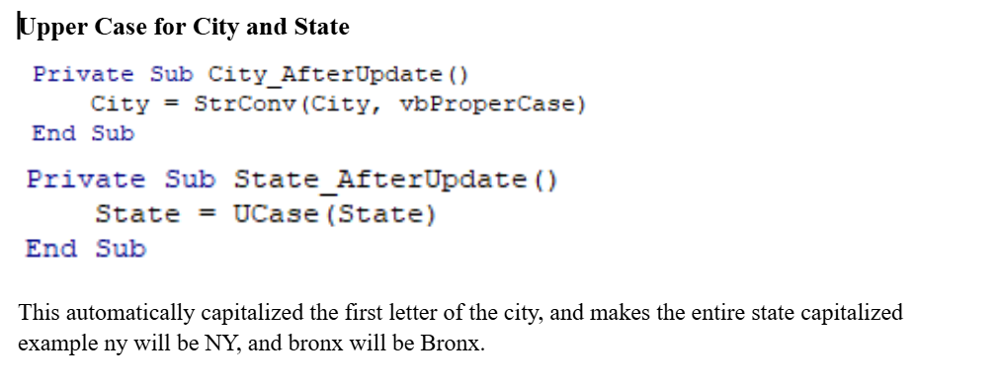 |

---

## 🔒 Database Highlights

- Fully normalized to 3NF
- Custom navigation forms
- Parameterized queries
- Integrated reports for business decisions
- Input validation using VBA

---

## 🧾 Technologies Used

- Microsoft Access
- SQL 
- VBA
- Lucidchart

---
